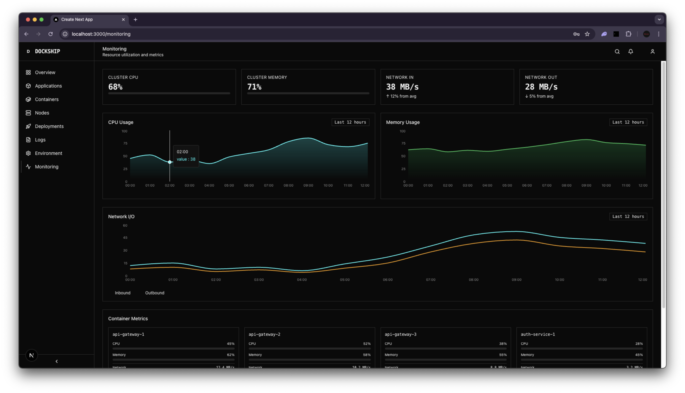

<h1 align="center">
  <br>
  <a href="https://orus-dev.netlify.app/projects"></a>
  <br>
  DockShip
  <br>
</h1>

<h4 align="center">A powerful self-hosted Deployment Platform</h4>

<p align="center">
  <a href="#key-features">Key Features</a> •
  <a href="#installation">Installation</a> •
  <a href="#license">License</a>
</p>



## Key Features

- Easy deployment

## Installation

#### Dependencies

- [Git](https://git-scm.com)
- [Docker](https://www.docker.com)
- [Node.js](https://nodejs.org/en/download/)

Run this on bash

```bash
wget -qO- https://raw.githubusercontent.com/orus-dev/dockship/refs/heads/master/installer.sh | bash
```

Or with curl

```bash
curl -fsSL https://raw.githubusercontent.com/orus-dev/dockship/refs/heads/master/installer.sh | bash
```

## License

MIT

> Website [orus-dev.app](https://orus-dev.netlify.app) &nbsp;&middot;&nbsp;
> GitHub [@orus-dev](https://github.com/orus-dev)

Huge thank you to [@amitmerchant1990](https://github.com/amitmerchant1990) for making this readme template
